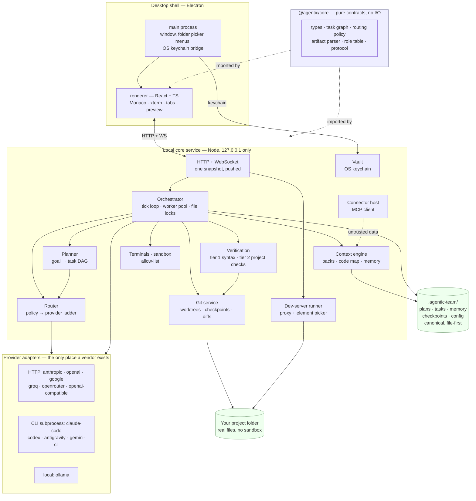
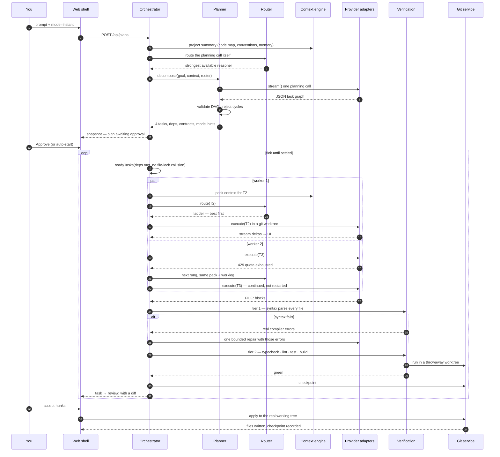

# Architecture

One page on what the pieces are, how they talk, and what happens when you type
one prompt in Instant mode.

## The shape



### Why these boundaries

**`@agentic/core` does no I/O.** It holds the types, the DAG algorithms, the
routing scorer and the artifact parser. Everything in it is a pure function, so
the parts most likely to deadlock a plan or write to the wrong path are the
parts that are exhaustively unit-testable without a network or a filesystem.

**Provider code lives in exactly one directory.** `server/src/providers/`. Every
adapter implements `ProviderAdapter`; nothing outside that directory imports a
vendor SDK or branches on a provider id. Adding a provider is one file.

**The server is local-only.** It binds `127.0.0.1`, and it is the only process
that ever calls a model. The renderer holds no keys.

**Canonical state is files.** `.agentic-team/` inside the project holds plans,
tasks, memory and config as plain JSON and Markdown. If deleting a JSON file
kills a feature, the feature is built wrong. Any index is rebuildable.

**One snapshot, pushed.** The server pushes a whole-state snapshot over a
WebSocket instead of exposing a REST endpoint per panel that the UI polls. This
costs bandwidth and buys the absence of panels disagreeing with each other.
Streaming model output is the one exception — per-token deltas go on their own
channel.

## Data flow: one prompt in Instant mode

You type _"Add Google sign-in to the settings page"_ and press Enter.



### What each step guarantees

| Step            | Guarantee                                                                              | Where                                      |
| --------------- | -------------------------------------------------------------------------------------- | ------------------------------------------ |
| Plan validation | No cycles, no dangling deps — a bad graph fails at plan time, not at 3am in a deadlock | `core/taskgraph.validateGraph`             |
| Scheduling      | Two agents never hold the same file                                                    | `core/taskgraph.readyTasks` + the lock set |
| Routing         | Every choice returns its score breakdown and is shown to you                           | `core/routing.scoreCandidates`             |
| Failover        | The same context pack and worklog move to the next rung — continued, not restarted     | `server/orchestrator`                      |
| Tier 1          | Every produced file parses, with one bounded auto-repair from the real error           | `server/verify`                            |
| Tier 2          | The project's own typecheck/lint/test/build, in a throwaway worktree                   | `server/projectchecks`                     |
| Human gate      | Enforced at the route layer, not in the UI                                             | `server/routes`                            |
| Taint           | External content never becomes instructions, and never self-accepts                    | `server/taint`                             |
| Rollback        | Every acceptance is a git checkpoint                                                   | `server/checkpoints`                       |

## The two modes

**Instant** — one planning call, a flat-ish DAG, generic workers, no role
preamble. Optimised for a small number of tokens and a short wall clock.

**Professional** — the same engine with a role table and phase gates:
discovery → design → implementation → verification → release. Each phase must
close before the next opens, and each role produces a named artefact (PRD, ADRs,
UX spec, tests, security review, release notes). Slower and more expensive by
design; the gates are the product.

Both run through one orchestrator. Professional mode is not a second engine —
it is a populated role table plus `PhaseGate` records.

## Failure behaviour

The system degrades rather than stopping:

| What breaks                    | What happens                                                                               |
| ------------------------------ | ------------------------------------------------------------------------------------------ |
| Provider hits its cap mid-task | Cooldown that rung; the task continues on the next with the same pack and worklog          |
| A CLI agent is not installed   | Probed at boot and on a timer; the ladder skips it; installing it mid-session lights it up |
| Model emits a truncated file   | Tier 1 catches it; one repair from the real parser error; then a human                     |
| Project has no test script     | Tier 2 reports `skipped`, with the reason, rather than passing silently                    |
| Every provider is down         | The plan pauses and says so. It never marks work done that no model produced               |
| A budget ceiling is hit        | Pause and ask, with the number, before spending past it                                    |

## Repository layout

```
packages/core/     contracts, DAG, routing, artifact parsing — no I/O
server/            orchestrator, adapters, git, pty, preview, connectors
  src/providers/   one file per provider; nothing else imports a vendor SDK
web/               React shell: Monaco, tabs, terminal, preview, chat
desktop/           Electron main process, packaging
cli/               `at` — headless access to the same server
docs/adr/          one ADR per contested decision
```
