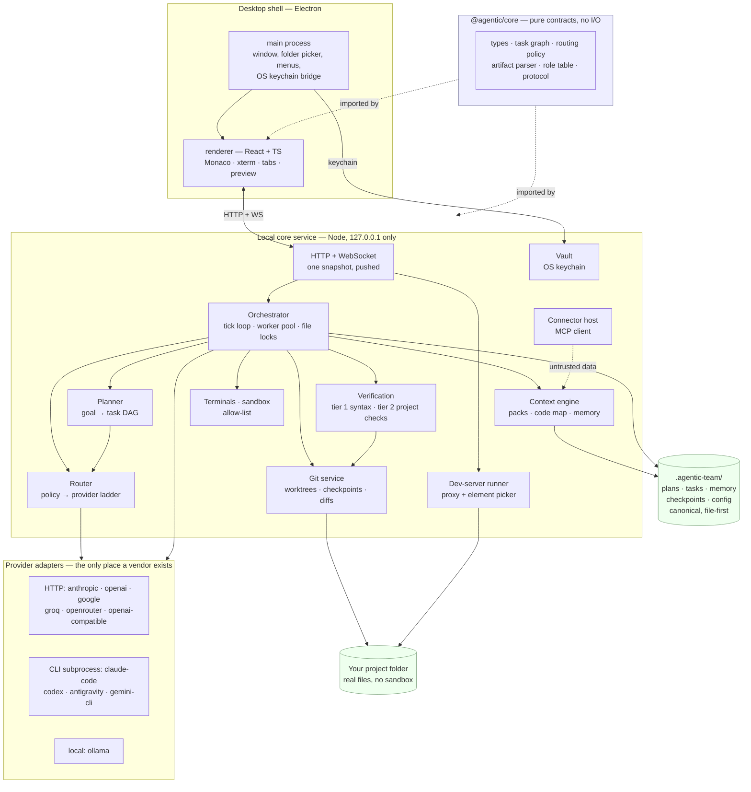
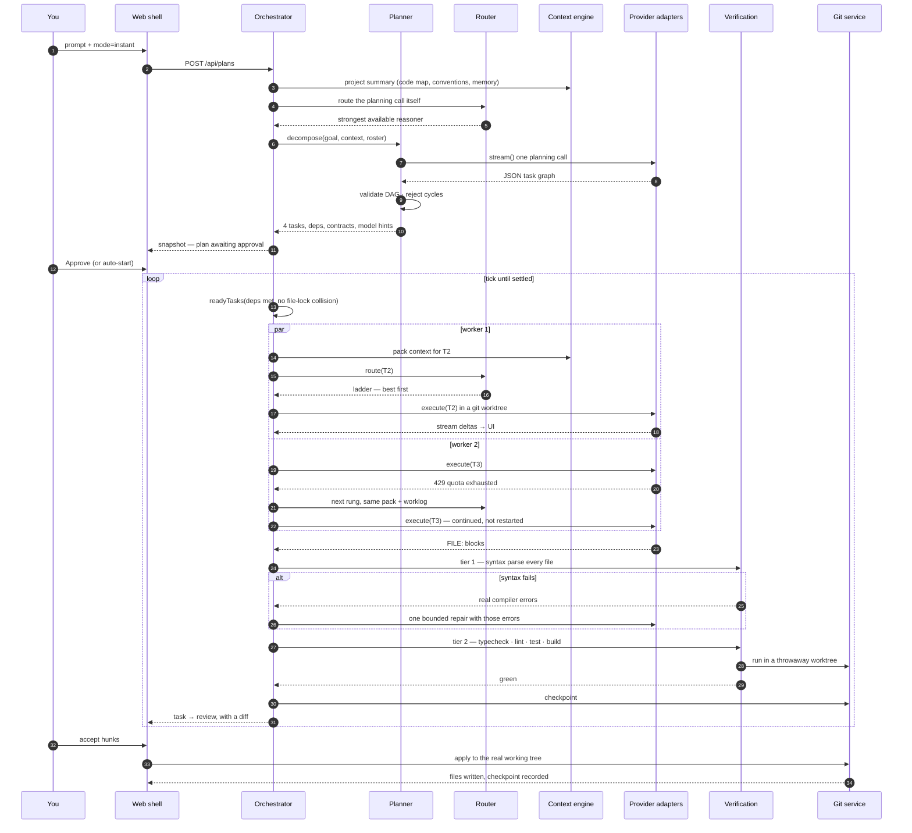

# Architecture

One page on what the pieces are, how they talk, and what happens when you type
one prompt in Instant mode.

## The shape



### Why these boundaries

**`@agentic/core` does no I/O.** It holds the types, the DAG algorithms, the
routing scorer and the artifact parser. Everything in it is a pure function, so
the parts most likely to deadlock a plan or write to the wrong path are the
parts that are exhaustively unit-testable without a network or a filesystem.

**Provider code lives in exactly one directory.** `server/src/providers/`. Every
adapter implements `ProviderAdapter`; nothing outside that directory imports a
vendor SDK or branches on a provider id. Adding a provider is one file.

**The server is local-only.** It binds `127.0.0.1`, and it is the only process
that ever calls a model. The renderer holds no keys.

**Canonical state is files.** `.agentic-team/` inside the project holds plans,
tasks, memory and config as plain JSON and Markdown. If deleting a JSON file
kills a feature, the feature is built wrong. Any index is rebuildable.

**One snapshot, pushed.** The server pushes a whole-state snapshot over a
WebSocket instead of exposing a REST endpoint per panel that the UI polls. This
costs bandwidth and buys the absence of panels disagreeing with each other.
Streaming model output is the one exception — per-token deltas go on their own
channel.

## Data flow: one prompt in Instant mode

You type _"Add Google sign-in to the settings page"_ and press Enter.



### What each step guarantees

| Step            | Guarantee                                                                              | Where                                      |
| --------------- | -------------------------------------------------------------------------------------- | ------------------------------------------ |
| Plan validation | No cycles, no dangling deps — a bad graph fails at plan time, not at 3am in a deadlock | `core/taskgraph.validateGraph`             |
| Scheduling      | Two agents never hold the same file                                                    | `core/taskgraph.readyTasks` + the lock set |
| Routing         | Every choice returns its score breakdown and is shown to you                           | `core/routing.scoreCandidates`             |
| Failover        | The same context pack and worklog move to the next rung — continued, not restarted     | `server/orchestrator`                      |
| Tier 1          | Every produced file parses, with one bounded auto-repair from the real error           | `server/verify`                            |
| Visual          | The page is rendered at two widths and checked for layouts that are objectively broken | `server/visual/check`                       |
| Tier 2          | The project's own typecheck/lint/test/build, in a throwaway worktree                   | `server/projectchecks`                     |
| Human gate      | Enforced at the route layer, not in the UI                                             | `server/routes`                            |
| Taint           | External content never becomes instructions, and never self-accepts                    | `server/taint`                             |
| Rollback        | Every acceptance is a git checkpoint                                                   | `server/checkpoints`                       |
| Effort          | A task gets the model, effort and verification its complexity warrants, not the maximum | `core/profiles.profileFor`                 |
| Expertise       | A task is matched to the specialist prompt and skills for what it is about              | `core/matching.selectAgent`                |
| Placeholders    | A file the model described instead of writing never reaches disk                        | `server/placeholders`                      |

## Visual verification

Tier 1 asks whether the files parse. Tier 2 asks whether the project's own suite
passes. Neither can tell you whether the page is broken, and a run proved it: a
calculator shipped whose CSS grid had a hole in it — one key had a span, every
key after it had shifted, and the last sat alone on a row of its own. It parsed,
had no secrets, and the greenfield project had no tests to fail. It was accepted
as verified and it was visibly wrong.

So between the two tiers, the page is rendered and looked at. The task's files
are served from memory as an overlay on the project, so the working tree is
still untouched when a human sees the result, and the page is loaded at a phone
width and a desktop width, because a layout that survives one and collapses at
the other is the most common defect there is.

What it checks is deliberately narrow — things that are objectively broken, not
matters of taste:

| Check | What it catches |
| ----- | --------------- |
| grid holes | An empty cell in the middle of a grid; the items after it are misplaced |
| horizontal overflow | The page scrolls sideways, naming the element that is too wide |
| overlap | Two in-flow siblings drawn on top of each other |
| unclickable | A control with no clickable area |
| clipped text | Text cut off with no ellipsis (a warning: it is sometimes intended) |
| invisible text | Text under 2:1 contrast against its own background |
| empty page | Nothing rendered at all |
| load failures | Uncaught exceptions and sub-resources that 404 |

Every one had to pass the same test to be included: could a competent person
look at it and call it deliberate? Where that is ever plausible it is a warning;
where it is not, it is an error and the task is sent back with the measurement.
The counterpart tests matter as much as the detection ones — a gate that fires
on a legitimate visually-hidden label or a partially-filled last row is a gate
people learn to ignore.

Rendering needs a browser, and the dependency is inverted so the server never
imports one. The desktop app already ships Chromium and registers it at boot;
a development checkout falls back to Playwright; an installation with neither
reports the check as SKIPPED with a reason, never as passed.

## Running what was built

A generated project has never been installed. It is a `package.json`, some
source, and no `node_modules` — so its dev server dies on the first `require`,
and the preview used to report "the dev server exited with code 1", which is
true and useless. Pressing the button that is supposed to run your new Express
or MERN app did nothing but produce an error.

So starting a preview installs first, with the project's own package manager
(the lockfile decides), and says what it is doing while it happens. A
multi-minute install and a hang look identical behind a spinner, and the
difference is the whole message.

Finding the server is evidence-driven at every step:

| Question | Answer |
| -------- | ------ |
| What runs it? | A `dev`/`start`/`serve` script; failing that a bare `server.js`, `app.js` or `index.js`, because a generated Express app frequently has no script at all. Django, Flask and FastAPI are detected from `manage.py` and what the entry file imports; Go from `main.go`. |
| Which port? | The URL the server printed. Failing that, a port it announced in prose — `Server running on port 3000` is the first thing anyone writes. Failing that, the framework guess. |
| Is that port ours? | Only if it was NOT already listening before we started. A port already in use belongs to somebody else, and proxying to it showed a stranger's application in the user's preview. |
| Which loopback? | Both are tried, and the one that answers is the one the proxy connects to. On Windows `localhost` resolves to `::1` first and Vite binds only there, so a server that had started perfectly was invisible to a check on `127.0.0.1`. |
| Are its dependencies there? | Every package in the project, not just the root — a MERN app is a `client/` and a `server/`, each with its own `package.json`. A `workspaces` field means one root install covers them all. |

The visual check does not run on a project that serves its own pages. Reading an
Express app's templates off disk answers a question nobody asked: static assets
are mounted, templates are compiled, and routes are not files. It once called a
correct login app broken because `/style.css` — served by Express from `public/`
— was a 404 to a plain file server, and burned the task's three attempts on a
defect that was entirely in the check. Those projects are covered by **Check
layout**, which audits the app actually running.

## How hard a task tries

Routing decides WHO runs a task. A profile decides how hard they try, and it is
the difference between a simple job taking four minutes and taking twenty-five
seconds. Measured on `make me a calculator` with Claude Code: 227s with the
agentic tool loop, 25s without, both producing a complete working calculator.

`profileFor` makes **two independent decisions**, and keeping them separate is
the whole point.

**How hard to think** — model tier and reasoning effort — comes from complexity,
role and capability:

| Level        | When                                                             | Model | Effort |
| ------------ | ---------------------------------------------------------------- | ----- | ------ |
| **fast**     | Complexity ≤2                                                    | mid   | low    |
| **balanced** | Complexity 3, or any change to existing code                     | mid   | medium |
| **thorough** | Complexity ≥4, architecture, security review, strong reasoning   | large | high   |

**Whether to look around** — the tool loop — comes from whether there is
anything to look at. It is off when the project is empty, at every level.

That separation was learned the hard way. Conflating them meant a task that
needed judgement got an agentic loop as well, and a greenfield MERN scaffold
spent **777 seconds** — thirteen minutes — exploring a directory it was about to
create. A tool loop buys the ability to READ: to find the file, see how the
surrounding code is written, and check its own work. In an empty project there
is nothing to read, however hard the task is. So a scaffold now gets the
strongest model at the highest effort AND answers in one pass.

The floor works the other way too: a one-line change to a real codebase looks
trivial by complexity and is not, so anything touching existing code gets the
loop and the context whatever its score.

The syntax, secret and placeholder gates always run, so nothing broken is waved
through — only the project's own install-and-test cycle is skipped, and only
where there is no project to test yet.

This makes `complexity` load-bearing rather than decorative, which is why the
planner prompt carries an anchored rubric for it rather than adjectives.

## The two modes

**Instant** — one planning call, a flat-ish DAG, generic workers, no role
preamble. Optimised for a small number of tokens and a short wall clock.

**Professional** — the same engine with a role table and phase gates:
discovery → design → implementation → verification → release. Each phase must
close before the next opens, and each role produces a named artefact (PRD, ADRs,
UX spec, tests, security review, release notes). Slower and more expensive by
design; the gates are the product.

Both run through one orchestrator. Professional mode is not a second engine —
it is a populated role table plus `PhaseGate` records.

## Failure behaviour

The system degrades rather than stopping:

| What breaks                    | What happens                                                                               |
| ------------------------------ | ------------------------------------------------------------------------------------------ |
| Provider hits its cap mid-task | Cooldown that rung; the task continues on the next with the same pack and worklog          |
| A CLI agent is not installed   | Probed at boot and on a timer; the ladder skips it; installing it mid-session lights it up |
| Model emits a truncated file   | Tier 1 catches it; one repair from the real parser error; then a human                     |
| Project has no test script     | Tier 2 reports `skipped`, with the reason, rather than passing silently                    |
| Every provider is down         | The plan pauses and says so. It never marks work done that no model produced               |
| A budget ceiling is hit        | Pause and ask, with the number, before spending past it                                    |

## Repository layout

```
packages/core/     contracts, DAG, routing, profiles, matching, artifact parsing — no I/O
server/            orchestrator, adapters, git, pty, preview, connectors
  src/providers/   one file per provider; nothing else imports a vendor SDK
  src/library/     built-in specialist agents and skills, matched per task
  src/visual/      renders a page and reports what is visibly broken
web/               React shell: Monaco, tabs, terminal, preview, chat
desktop/           Electron main process, packaging
cli/               `at` — headless access to the same server
docs/adr/          one ADR per contested decision
docs/DESIGN-BRIEF.md   the prompt for redesigning the frontend
```
